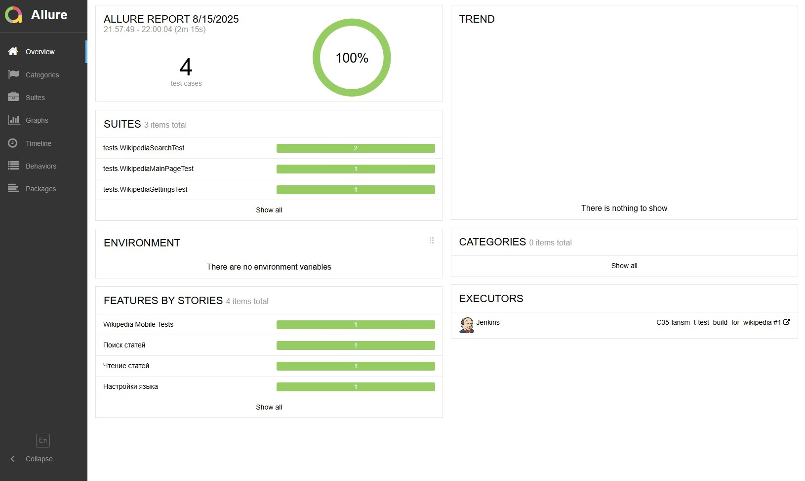
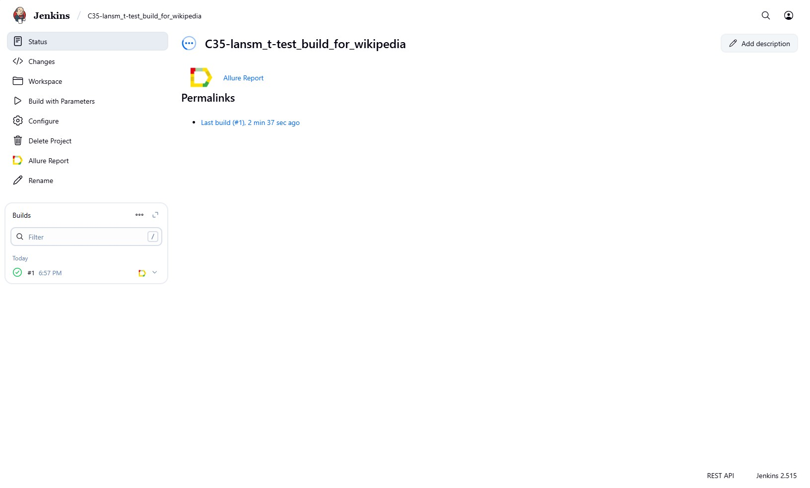
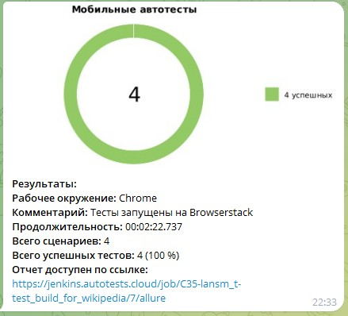

# Проект по автоматизации мобильных тестов Android-приложения [Wikipedia](https://ru.wikipedia.org) 


## Содержание:

- [Технологии и инструменты](#технологии-и-инструменты)
- [Тестовые сценарии](#тестовые-сценарии)
- [Сборка в Jenkins](#jenkins-build)
- [Запуск из терминала](#Команды-для-запуска)
- [Allure отчет](#allure-report)
- [Уведомление в Telegram при помощи бота](#уведомление-в-telegram-при-помощи-бота)

## Технологии и инструменты:
<table>
  <tr>
    <th><a href="https://www.oracle.com/java/" target="_blank">Java</a></th>
    <th><a href="https://www.jetbrains.com/idea/" target="_blank">IntelliJ IDEA</a></th>
    <th><a href="https://github.com/" target="_blank">GitHub</a></th>
    <th><a href="https://junit.org/junit5/" target="_blank">JUnit 5</a></th>
    <th><a href="https://gradle.org/" target="_blank">Gradle</a></th>
    <th><a href="https://qameta.io/" target="_blank">Allure</a></th>
    <th><a href="https://www.browserstack.com/" target="_blank">Browserstack</a></th>
  </tr>
</table>

## Тестовые сценарии
- Тест-кейс №1: Проверка наличия раздела с новостями на главной странице
- Тест-кейс №2: Проверка работы поиска по названию статьи
- Тест-кейс №3: Проверка возможности открыть статью из результатов поиска
- Тест-кейс №4: Проверка возможности добавить другой язык в приложение



---
- Тесты реализованы на <code>Java</code> с использованием фреймворка Selenide и паттерна Page Object.
- В качестве сборщика используется <code>Gradle</code>.
- Для модульного тестирования применён фреймворк <code>JUnit 5</code>.
- Для работы проекта используется Browserstack.
---

<h3 id="jenkins-build"> 
   Сборка в <a href="https://jenkins.autotests.cloud/job/C35-lansm_t-test_build_for_wikipedia/">Jenkins</a>
</h3>

**Параметры сборки в Jenkins:**

- **browser** (браузер, по умолчанию chrome)
- **browserVersion** (версия браузера, по умолчанию 128.0)
- **browserSize** (размер окна браузера, по умолчанию 1920x1080)
- **selenoidLogin** (логин удаленного сервера Selenoid)
- **selenoidPassword** (пароль удаленного сервера Selenoid)




## Команды для запуска
### Удаленный запуск (через browserstack)
```bash
gradle clean browserstack_test -Dhost=browserstack_test
```

```bash
./gradlew.bat clean browserstack_test -Dhost=browserstack_test 
```
---

<h3 id="allure-report">
  
  Allure <a href="https://jenkins.autotests.cloud/job/C35-lansm_t-test_build_for_wikipedia/7/allure/">отчёт</a>
</h3>


---
### Уведомление в Telegram при помощи бота

